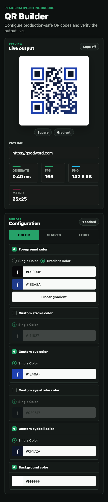
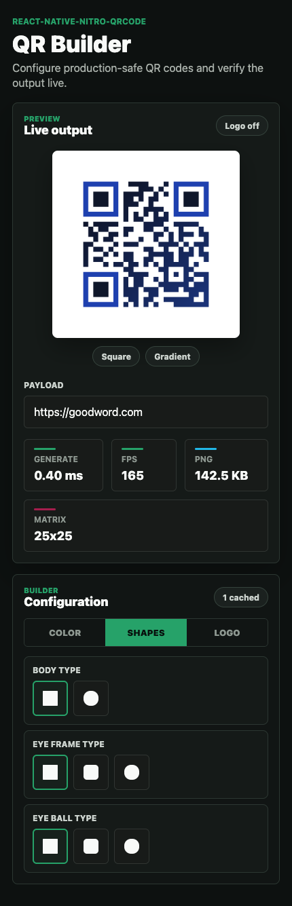
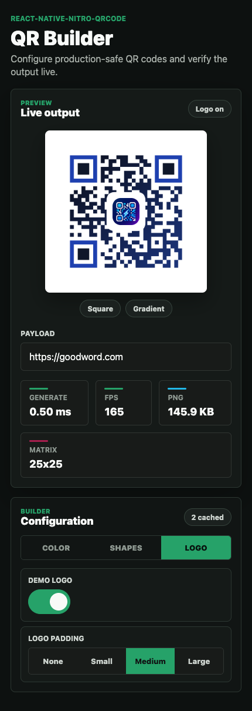

# react-native-nitro-qrcode

[](https://www.npmjs.com/package/react-native-nitro-qrcode)
[](./LICENSE)


`react-native-nitro-qrcode` is a fast QR code generator for React Native and Expo built with Nitro and native C++.

Use it when you want a QR code package that works on iOS, Android, and web without adding `react-native-svg` or Skia. The component renders a PNG-backed `Image`, and the library also exposes QR export helpers for PNG, SVG, and matrix data.

<p align="center">
  
  
  
</p>

## Why this package

- No `react-native-svg`
- No Skia dependency
- Native mobile QR generation through Nitro Modules and shared C++
- Works with React Native, Expo development builds, and React Native Web
- Supports PNG export, SVG export, and matrix access
- Supports square and circular modules with rounded finder eyes
- Supports eye styling, module gaps, logo safe areas, and linear or radial gradients
- Includes deterministic caching for repeated QR generation

## Features

- Native iOS and Android QR generation through Nitro Modules
- Shared C++ QR engine for consistent output across mobile platforms
- PNG base64 and `data:image/png` output for rendering, sharing, and export
- Compact SVG string generation for advanced workflows
- Packed matrix export for custom rendering or scanability tooling
- Native styling for square and circular modules
- Finder-eye styling, module gaps, and centered logo clear areas
- Solid colors and opt-in linear or radial foreground gradients
- Web fallback for Expo web demos and documentation environments
- Deterministic cache keyed by QR options

## React Native QR Code Alternatives

If you are comparing packages:

- `react-native-qrcode-svg`: good SVG-based default, but requires `react-native-svg`
- `react-native-qrcode-skia`: good for Skia-heavy apps, but requires Skia
- `react-native-nitro-qrcode`: better fit when you want native output, export helpers, and fewer rendering dependencies

This package is designed for teams that want QR generation to stay lightweight at the app surface while still having native performance and export APIs.

## Installation

```sh
bun add react-native-nitro-qrcode react-native-nitro-modules
```

## Requirements

- React `>=18.2.0 <20.0.0`.
- React Native `>=0.75.0 <1.0.0`.
- `react-native-nitro-modules >=0.35.4 <0.36.0`.
- iOS 13+ and Android API 24+.
- Web support requires the app's normal React Native Web setup: `react-dom >=18.2.0 <20.0.0` and `react-native-web >=0.19.0 <1.0.0`. These peers are optional so native-only apps are not forced to install them.

`qrcode` is bundled as an internal runtime dependency for the web fallback. Consumers do not need `react-native-svg`, Skia, canvas packages, or a separate QR package.

## Expo Support

This package works with Expo development builds. Expo Go cannot load Nitro native code.

```sh
bunx expo prebuild
bunx expo run:ios
bunx expo run:android
```

For bare React Native, install pods after adding the package:

```sh
cd ios && pod install
```

## Quick Start

```tsx
import { QRCode } from "react-native-nitro-qrcode";

export function CheckoutCode() {
  return (
    <QRCode
      value="https://example.com/checkout/123"
      size={220}
      errorCorrectionLevel="M"
    />
  );
}
```

`QRCode` returns an `Image`-backed view. The QR image is generated asynchronously through Nitro on mobile and through the web fallback on web.

## Supported Platforms

- iOS
- Android
- Web

The mobile path uses native Nitro bindings. The web path uses the bundled web fallback so the same API can work in Expo web and React Native Web environments.

## Styling

Style the QR code without `react-native-svg`, Skia, or any extra runtime package:

```tsx
import { Text, View } from "react-native";
import { QRCode } from "react-native-nitro-qrcode";

export function BrandedCode() {
  return (
    <QRCode
      value="https://example.com/checkout/123"
      size={240}
      errorCorrectionLevel="H"
      foregroundColor="#101112"
      backgroundColor="#FFFFFF"
      gradient={{
        colors: ["#7AC7FF", "#4AA8FF", "#327EFF"],
        locations: [0, 0.45, 1],
        start: { x: 0, y: 0 },
        end: { x: 1, y: 1 },
      }}
      shapeOptions={{
        shape: "circle",
        eyeFrameShape: "rounded",
        eyeballShape: "circle",
        gap: 1,
        eyePatternGap: 1,
      }}
      logoAreaSize={64}
      logoAreaBorderRadius={12}
      logo={
        <View
          style={{
            alignItems: "center",
            backgroundColor: "#101112",
            borderRadius: 8,
            height: 44,
            justifyContent: "center",
            width: 44,
          }}
        >
          <Text style={{ color: "#28D17C", fontWeight: "900" }}>N</Text>
        </View>
      }
    />
  );
}
```

The native renderer keeps the public layout scan-safe with matrix output, then layers module shapes, finder-eye shapes, gaps, a centered logo safe area, and foreground gradients on top. Solid colors stay on the fastest indexed PNG path. Gradients are opt-in and switch to RGBA PNG encoding only for that render.

## Generate Assets

```ts
import { NitroQRCode } from "react-native-nitro-qrcode";

const dataUri = NitroQRCode.toPngDataUri({
  value: "https://example.com",
  size: 512,
});

const base64 = NitroQRCode.toPngBase64({
  value: "https://example.com",
  size: 1024,
  errorCorrectionLevel: "H",
});

const asyncDataUri = await NitroQRCode.toPngDataUriAsync({
  value: "https://example.com",
  size: 512,
});

const matrix = NitroQRCode.getMatrix({
  value: "https://example.com",
});
```

Available helpers:

- `NitroQRCode.toPngDataUri(options)` returns a `data:image/png;base64,...` URI.
- `NitroQRCode.toPngBase64(options)` returns PNG bytes encoded as base64.
- `NitroQRCode.toPngDataUriAsync(options)` returns a data URI without blocking the JS caller.
- `NitroQRCode.toPngBase64Async(options)` returns base64 without blocking the JS caller.
- `NitroQRCode.toSvgString(options)` returns a compact SVG string.
- `NitroQRCode.getMatrix(options)` returns `{ size, packedBase64 }`.
- `NitroQRCode.clearCache()` clears generated-output cache.
- `NitroQRCode.getCacheSize()` returns the current cache entry count.

## API Overview

Main component:

- `QRCode`

Helpers:

- `NitroQRCode.toPngDataUri`
- `NitroQRCode.toPngBase64`
- `NitroQRCode.toPngDataUriAsync`
- `NitroQRCode.toPngBase64Async`
- `NitroQRCode.toSvgString`
- `NitroQRCode.getMatrix`
- `NitroQRCode.clearCache`
- `NitroQRCode.getCacheSize`

## Options

| Option                         | Type                                    | Default                                            |
| ------------------------------ | --------------------------------------- | -------------------------------------------------- |
| `value`                        | `string`                                | required                                           |
| `size`                         | `number`                                | `180` for `<QRCode />`, `512` for asset helpers    |
| `quietZone`                    | `number`                                | `4`                                                |
| `errorCorrectionLevel`         | `"L"` \| `"M"` \| `"Q"` \| `"H"`        | `"M"`                                              |
| `foregroundColor`              | `#RRGGBB` or `#RRGGBBAA`                | `#000000`                                          |
| `backgroundColor`              | `#RRGGBB` or `#RRGGBBAA`                | `#FFFFFF`                                          |
| `strokeColor`                  | `#RRGGBB` or `#RRGGBBAA`                | `#000000`                                          |
| `eyeColor`                     | `#RRGGBB` or `#RRGGBBAA`                | `#000000`                                          |
| `eyeStrokeColor`               | `#RRGGBB` or `#RRGGBBAA`                | `#000000`                                          |
| `eyeballColor`                 | `#RRGGBB` or `#RRGGBBAA`                | `#000000`                                          |
| `gradient.type`                | `"linear"` \| `"radial"`                | `"linear"`                                         |
| `gradient.colors`              | `string[]`                              | `undefined`                                        |
| `gradient.locations`           | `number[]` in `0...1`                   | evenly spaced                                      |
| `gradient.start`               | `{ x: number, y: number }`              | `{0,0}` for linear, `{0.5,0.5}` for radial         |
| `gradient.end`                 | `{ x: number, y: number }`              | `{1,1}`                                            |
| `shapeOptions.layout`          | `"matrix"`                              | `"matrix"`                                         |
| `shapeOptions.shape`           | `"square"` \| `"circle"`                | `"square"`                                         |
| `shapeOptions.eyeFrameShape`   | `"square"` \| `"rounded"` \| `"circle"` | `"square"`                                         |
| `shapeOptions.eyeballShape`    | `"square"` \| `"rounded"` \| `"circle"` | `"square"`                                         |
| `shapeOptions.gap`             | `number`                                | `0`                                                |
| `shapeOptions.eyePatternGap`   | `number`                                | `shapeOptions.gap`                                 |
| `shapeOptions.eyePatternCornerRadius` | `number`                         | automatic for rounded finder eyes                  |
| `logo`                         | `ReactNode` for `<QRCode />`            | `undefined`                                        |
| `logoAreaSize`                 | `number`                                | `0`, or `28%` of component size when `logo` is set |
| `logoAreaBorderRadius`         | `number`                                | `0`                                                |
| `minVersion`                   | `1...40`                                | `1`                                                |
| `maxVersion`                   | `1...40`                                | `40`                                               |
| `mask`                         | `-1` or `0...7`                         | `-1`                                               |
| `boostEcl`                     | `boolean`                               | `true`                                             |

`errorCorrectionLevel` also accepts `"low"`, `"medium"`, `"quartile"`, and `"high"`.

`gradient.colors` must contain between 2 and 8 colors. When `gradient` is provided, it overrides the solid `foregroundColor` for PNG and SVG output while keeping the no-gradient path fast.

`shapeOptions.eyePatternShape` is still accepted as a deprecated alias for `shapeOptions.eyeFrameShape`.

## Performance Notes

- Solid-color QR codes stay on the fastest indexed PNG path
- Gradient renders are opt-in and use RGBA PNG encoding only when needed
- Repeated identical renders benefit from the built-in cache
- The example app includes generation timing, FPS, PNG size, matrix size, and cache metrics

## Example App

The repo includes an Expo example with a live QR demo, generation timing, FPS, PNG size, matrix size, and cache metrics.

```sh
bun install
bun run example:web
bun run example:ios
bun run example:android
```

When testing native payload changes, keep the matching device log open:

```sh
bun run example:logs:ios
bun run example:logs:android
```

The example should stay at 55 FPS or higher while editing the payload. Treat any native redbox, crash, repeated warning, or sustained FPS drop as a release blocker.

## When to use this package

Use `react-native-nitro-qrcode` if you need one or more of these:

- a React Native QR code package without `react-native-svg`
- an Expo-compatible QR package for development builds
- PNG export for sharing, printing, or caching
- QR styling beyond a plain black square
- a QR component that also works on web

If your app already depends heavily on Skia and your QR rendering is part of a larger Skia canvas workflow, a Skia-based package can still be a better fit.

## Development

```sh
bun install
bun run check
```

Useful repo scripts:

- `bun run dev` starts the Expo example.
- `bun run check` runs the full library and example verification pass.
- `bun run example:check` runs example lint plus `expo-doctor`.
- `bun run --cwd packages/react-native-nitro-qrcode verify` runs the package-only gate.

`bun run test:coverage` enforces 100% TypeScript coverage. `bun run test:cpp` compiles the C++ core and checks 100% LLVM line coverage for `QRCodeGenerator.cpp`.

## Roadmap

The current focus is:

- keeping the core QR path fast and predictable
- keeping the dependency surface small
- improving styling without introducing renderer-heavy dependencies
- keeping native, web, and example behavior aligned

## License and Credits

MIT.

The C++ QR encoder is vendored from Project Nayuki's QR Code generator library under the MIT License.
