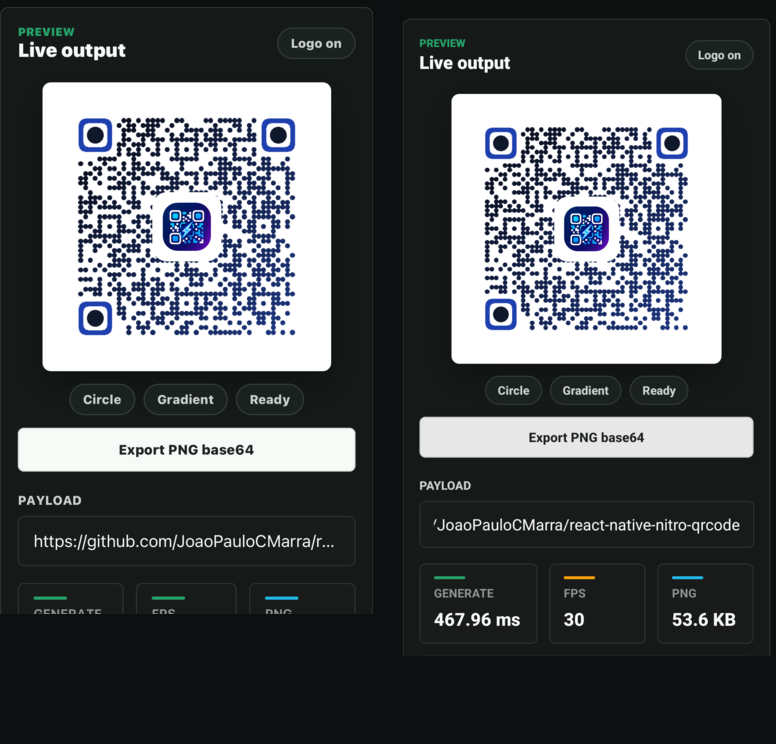

# react-native-nitro-qrcode

[](https://www.npmjs.com/package/react-native-nitro-qrcode)
[](https://github.com/JoaoPauloCMarra/react-native-nitro-qrcode/blob/main/LICENSE)
[](https://reactnative.dev/)
[](https://expo.dev/)
[](https://nitro.margelo.com/)

QR code generation for React Native, Expo, and web without requiring
`react-native-svg` or Skia.

Use it when you want a typed QR component plus PNG, SVG, matrix, caching, logo,
gradient, and scanability helpers from one package.

<p align="center">
  
</p>

## Install

```sh
bun add react-native-nitro-qrcode react-native-nitro-modules
```

For Expo development builds:

```sh
bunx expo install react-native-nitro-qrcode react-native-nitro-modules
bunx expo prebuild
```

For bare React Native apps:

```sh
cd ios && pod install
```

Expo Go cannot load Nitro native modules. Use an Expo development build or a
bare app.

## Expo Config

No app config options are required for `react-native-nitro-qrcode`.

The package includes a no-op config plugin for compatibility with apps that keep
all native packages in the Expo `plugins` array, but new apps can omit it.

## Quick Start

```tsx
import { QRCode } from "react-native-nitro-qrcode";

export function PaymentCode() {
  return (
    <QRCode
      value="https://example.com/pay/invoice_123"
      size={220}
      foregroundColor="#111827"
      backgroundColor="#ffffff"
      errorCorrectionLevel="H"
    />
  );
}
```

## Export Helpers

```ts
import {
  getMatrix,
  toPngBase64,
  toPngDataUri,
  toSvgString,
} from "react-native-nitro-qrcode";

const options = {
  value: "https://example.com",
  size: 320,
  errorCorrectionLevel: "H",
} as const;

const png = toPngBase64(options);
const uri = toPngDataUri(options);
const svg = toSvgString(options);
const matrix = getMatrix(options);
```

Async variants are available for UI flows that should yield before generating:
`toPngBase64Async` and `toPngDataUriAsync`.

## Styling

Common options:

| Option                 | What it does                                |
| ---------------------- | ------------------------------------------- |
| `value`                | QR payload string.                          |
| `size`                 | Rendered image size in points.              |
| `errorCorrectionLevel` | `L`, `M`, `Q`, or `H`. Use `H` with logos.  |
| `foregroundColor`      | Solid module color.                         |
| `backgroundColor`      | Solid color or `transparent`.               |
| `bodyShape`            | `square`, `circle`, or `rounded`.           |
| `eyeFrameShape`        | Finder frame shape.                         |
| `eyeBallShape`         | Finder center shape.                        |
| `moduleGap`            | Space between modules.                      |
| `logo`                 | Center logo with safe-area clearing.        |
| `gradient`             | Linear or radial foreground gradient.       |
| `preset`               | `default`, `rounded`, `dots`, or `branded`. |

```tsx
<QRCode
  value="https://example.com/app"
  size={260}
  preset="branded"
  bodyShape="rounded"
  eyeFrameShape="rounded"
  eyeBallShape="circle"
  moduleGap={0.1}
  logo={{ source: require("./logo.png"), size: 48 }}
  gradient={{
    type: "linear",
    colors: ["#111827", "#2563eb"],
    start: { x: 0, y: 0 },
    end: { x: 1, y: 1 },
  }}
/>
```

## Validation And Scanability

```ts
import { validateOptions } from "react-native-nitro-qrcode";

const result = validateOptions({
  value: "https://example.com",
  size: 180,
  backgroundColor: "transparent",
  logo: { size: 64 },
});

if (!result.valid) {
  console.log(result.errors);
}
```

The validator reports hard errors and scanability warnings for risky logo,
contrast, size, and option combinations.

## API

Main exports:

- `QRCode` React component.
- `NitroQRCode` object with the same generation helpers.
- `toPngBase64`, `toPngDataUri`, `toSvgString`, and `getMatrix`.
- `toPngBase64Async` and `toPngDataUriAsync`.
- `validateOptions`.
- `clearQRCodeCache` and `getQRCodeCacheSize`.
- TypeScript types including `QRCodeOptions`, `QRCodeProps`, `QRCodeRef`,
  `QRCodeMatrix`, and `QRCodeValidationResult`.

## Platform Support

| Platform | Status                                                              |
| -------- | ------------------------------------------------------------------- |
| iOS      | Native Nitro module with shared C++ QR engine.                      |
| Android  | Native Nitro module with shared C++ QR engine.                      |
| Web      | JavaScript fallback through React Native Web.                       |
| Expo     | Development builds; Expo Go is not supported for native Nitro code. |

`qrcode` is bundled for the web fallback. Consumers do not need
`react-native-svg`, Skia, canvas packages, or another QR package.

## Troubleshooting

- **Expo Go error:** build a dev client; Expo Go cannot load Nitro modules.
- **Logo makes the code hard to scan:** use `errorCorrectionLevel="H"` and a
  smaller logo.
- **Transparent background scans poorly:** validate contrast in the actual UI
  where the QR code appears.
- **Need SVG output:** use `toSvgString`; the component itself renders a
  PNG-backed `Image`.

## Development

```sh
bun install
bun run check
bun run release:preflight
bun run example:android
bun run example:ios
```

Run native example builds before release when changing plugin, native, Nitro, or
packaging files.

## License

MIT
